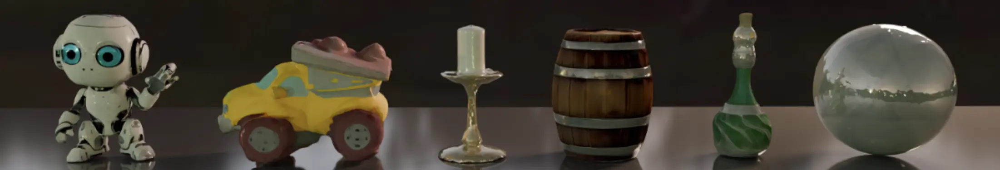

# [CVPR2025] MAGE🧙: Single Image to Material-Aware 3D via the Multi-View G-Buffer Estimation Model



### Install

You can simply run the `setenv.sh` script, or `conda env create -f env.yaml` to install the environment.

### Inference

```bash
cd 0123Material

# infer multi-view: pred mv images -> domain transfer
python infer_mat3d.py --workspace <your_workspace> --domain_transfer_unet_path ../files/mat3d.safetensors --mv_unet_path ../files/0123pp.safetensors --test_path <your_test_path> --seed 88 --pred_mv --no-no_rembg

# infer single view: domain transfer for input view
python infer_mat3d.py mat3d --workspace <your_workspace> --test_path <your_test_path> --domain_transfer_unet_path ../files/mat3d.safetensors --mv_unet_path files/0123pp.safetensors --no-no_rembg --no-pred_mv
```

### Training Dataset

Please download the dataset from [here](https://huggingface.co/datasets/onpix/mage-data/tree/main) and unzip it for your training.

### Training

```bash
# training
python train.py --base core/configs/0123Material/zero123plus.yaml --gpus 0,1,2,3,4,5,6,7  --num_nodes 1 --name 1 --logdir workspace/ --resume last data.params.batch_size=<your_batch_size> lightning.traininer.accumulate_grad_batches=<set_your_value> lightning.trainer.num_sanity_val_steps=-1 model.params.finetune_vae_decoder=false
```

### Acknowledgement

This work is built on many amazing research works and open-source projects (Zero123, InstantMesh, LGM, Unique3D, Driect2.5, etc.), thanks a lot to all the authors for sharing!

### Citation

```
@inproceedings{wang2025mage,
  title={MAGE: Single Image to Material-Aware 3D via the Multi-View G-Buffer Estimation Model},
  author={Haoyuan Wang, Zhenwei Wang, Xiaoxiao Long, Cheng Lin, Gerhard Hancke, Rynson W.H. Lau},
  booktitle={CVPR},
  year={2025}
}
```
